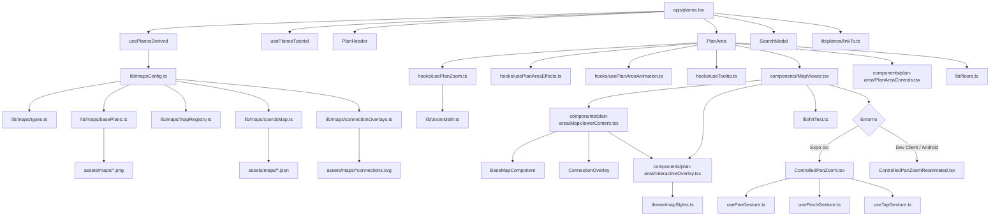

# Arquitectura de la sección Planos

Este documento describe de forma general los archivos y responsabilidades principales de la sección de planos interactivos de la app.

```mermaid
flowchart TD

    A[app/planos.tsx] --> B[usePlanosDerived]
    A --> C[usePlanosTutorial]
    A --> D[PlanHeader]
    A --> E[PlanArea]
    A --> F[SearchModal]

    B --> G[lib/mapsConfig.ts]
    G --> H[lib/maps/types.ts]
    G --> I[lib/maps/basePlans.ts]
    G --> J[lib/maps/mapRegistry.ts]
    G --> K[lib/maps/coordsMap.ts]
    G --> L[lib/maps/connectionOverlays.ts]

    I --> M[assets/maps/*.png]
    K --> N[assets/maps/*.json]
    L --> O[assets/maps/*connections.svg]

    E --> P[hooks/usePlanZoom.ts]
    E --> Q[hooks/usePlanAreaEffects.ts]
    E --> R[hooks/usePlanAreaAnimation.ts]
    E --> S[hooks/useTooltip.ts]
    E --> T[components/MapViewer.tsx]
    E --> U[components/plan-area/PlanAreaControls.tsx]

    T --> V[components/plan-area/MapViewerContent.tsx]
    T --> W[components/plan-area/InteractiveOverlay.tsx]
    T --> X[lib/hitTest.ts]

    T --> Y{Entorno}
    Y -->|Expo Go| Z[ControlledPanZoom.tsx]
    Y -->|Dev Client / Android| AA[ControlledPanZoomReanimated.tsx]

    Z --> AB[usePanGesture.ts]
    Z --> AC[usePinchGesture.ts]
    Z --> AD[useTapGesture.ts]

    V --> AE[BaseMapComponent]
    V --> AF[ConnectionOverlay]
    V --> W

    W --> AG[theme/mapStyles.ts]

    P --> AH[lib/zoomMath.ts]
    E --> AI[lib/floors.ts]
    A --> AJ[lib/planos/linkTo.ts]
```